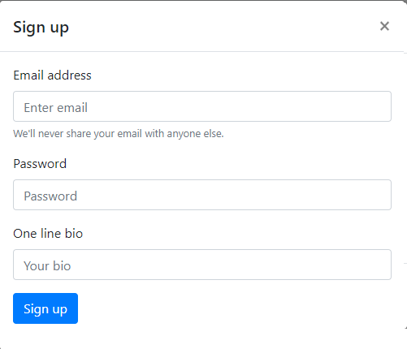
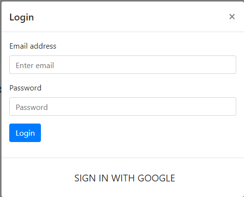
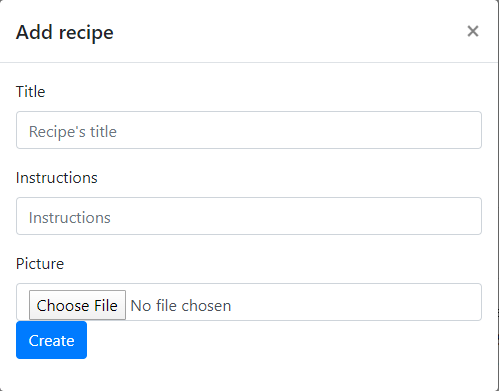

# Taste

Taste is an application that allows you to share your recipes with people all around the world. It is very easy to use.

## Built With

* Javascript
* Bootstrap
* Firebase

## Prototype

[TastePrototype](https://pr.to/RZW0NK/)

## Authors

* **Krzysztof Wcisło** 

* **Mateusz Woźniak** 

## What you can do

* Add your recipe
* View others' recipes
* Create your own account
* Login using google account

